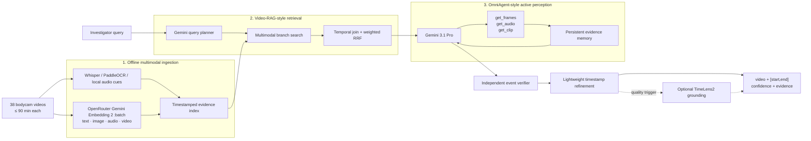
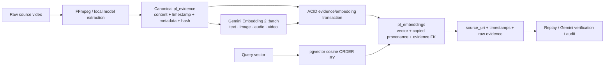
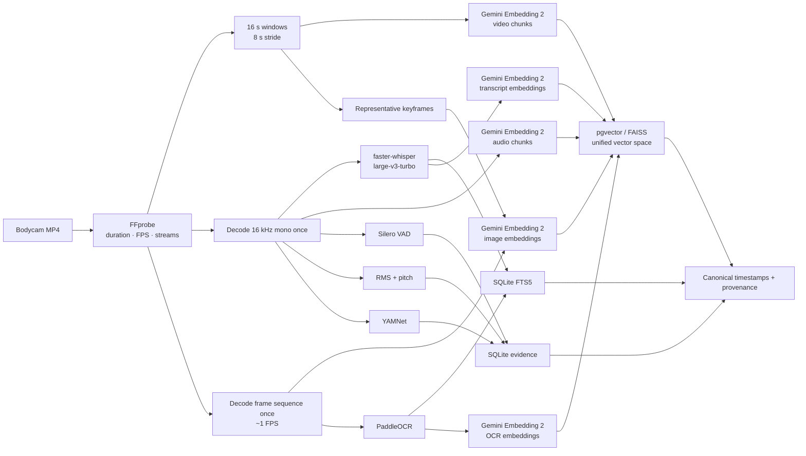
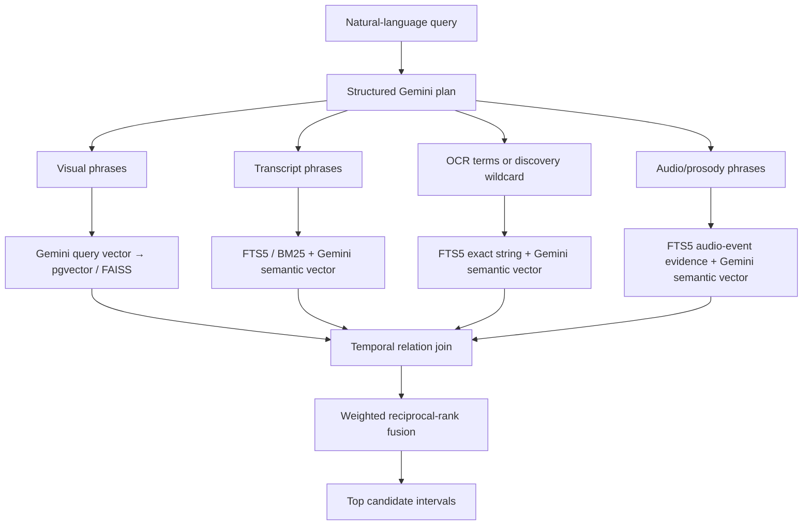
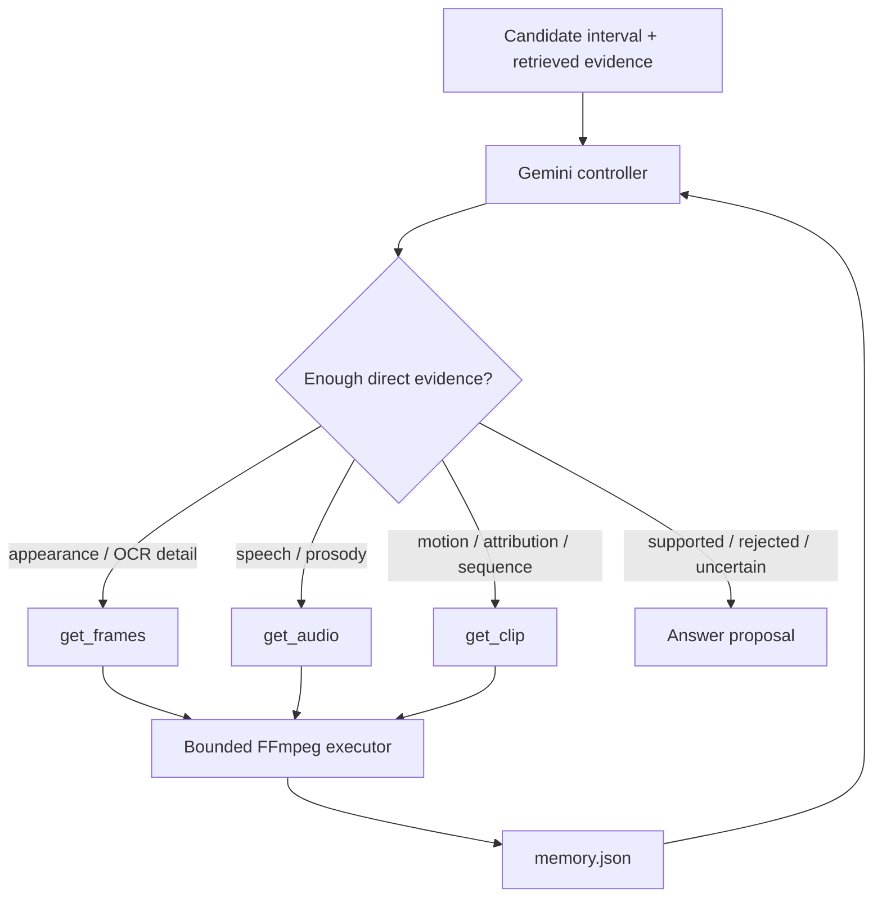
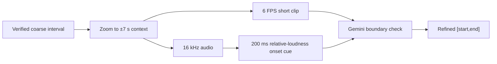
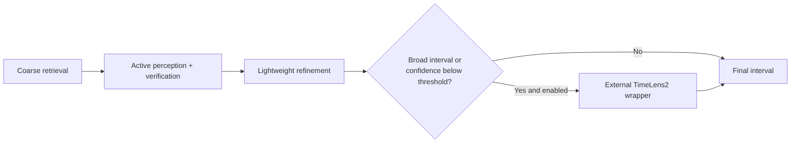
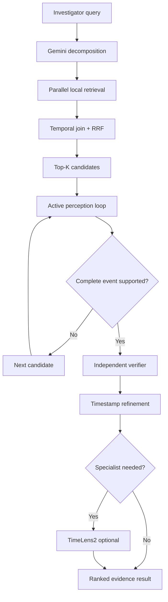
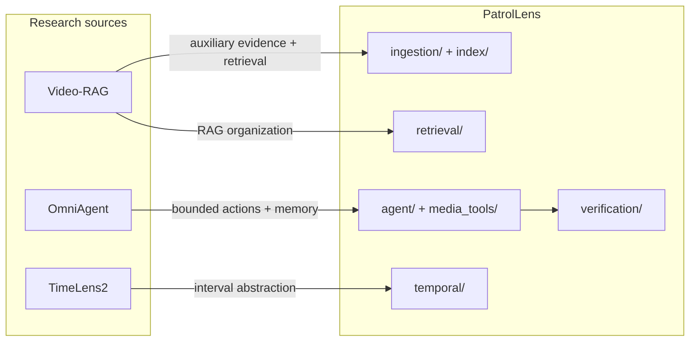

# PatrolLens system design

## Problem formalization

Given a corpus of videos $V = \{v_1, \ldots, v_n\}$, each potentially 90 minutes long, and a natural-language query $q$, return a ranked set:

$$
R(q) = \{(v_i, [t_s,t_e], p, E)\}
$$

where `[t_s,t_e]` is the smallest interval that supports the complete query, `p` is verifier confidence, and `E` is modality-specific evidence.

Offline extraction creates canonical observations:

$$
e = (id, video\_id, t_s, t_e, modality, content/vector, confidence, source)
$$

This representation is the architectural contract. Models and indexes can change as long as they produce or consume the same observation shape.

The system optimizes for precision on hard event queries. A retrieved frame containing a red jacket is evidence for an entity, not proof that the entity shouted. A final result must satisfy all of the query's entity, action, temporal, audio-language, and cross-modal attribution constraints.

## Overall architecture



The expensive semantic model is neither the database nor the first-pass scanner. It reasons over a small, retrieved evidence neighborhood.

## Traceable PostgreSQL + pgvector storage

SQLite/FAISS remains useful for a dependency-light local smoke test. The production backend is `PostgresIndexStore` with `PostgresVectorIndex`:



`pl_embeddings` intentionally duplicates the fields required to replay a hit: `video_id`, `segment_id`, `start_ms`, `end_ms`, `modality`, `source_uri`, `evidence_text`, `evidence_metadata`, `evidence_source`, `model_version`, `confidence`, `evidence_hash`, `source_sha256`, and `embedding_hash`. It also retains a foreign key to `pl_evidence`. The write path obtains the duplicated fields with `INSERT ... SELECT` from `pl_evidence JOIN pl_assets`, so an embedding cannot be created for missing evidence or an unknown video.

The ingestion pipeline calls `add_evidence_and_embeddings` for each visual batch. PostgreSQL commits the evidence and vectors together; a failed vector insert rolls back the evidence batch instead of leaving untraceable rows. A database trigger validates duplicated provenance on direct writes and synchronizes it when canonical evidence or asset metadata changes. Vector dimensions are stored per row, and a partial HNSW expression index is created for each observed dimension; the query filters by modality, model version, and dimension before ordering by cosine distance. This follows pgvector's expression-index pattern for variable-dimension columns.

At retrieval time, pgvector returns the embedding row directly. The adapter reconstructs `Evidence` from that row and attaches `embedding_id`, `source_uri`, `model_version`, `evidence_hash`, `source_sha256`, and `embedding_hash` to the returned metadata. A caller can use `get_embedding_trace(embedding_id)` to retrieve the complete vector/provenance record for replay or audit.

## 1. Offline multimodal ingestion



### Why these components exist

| Requirement | Component | Resolution |
|---|---|---|
| Visual appearance and cross-modal media | Gemini Embedding 2 | Unified semantic search over video chunks, images, audio, transcript, and OCR |
| Spoken language | faster-whisper | Word/utterance timestamps for Miranda rights, commands, names, and quotations |
| Visible writing | PaddleOCR | Literal plate/sign/badge text with frame timestamps and confidence |
| Voice/prosody | Silero + RMS/pitch | Speech presence and raised-intensity cues without pretending loudness proves speaker identity |
| Non-speech sound | YAMNet | Candidate cues for sirens, gunshots, barking, alarms, and related AudioSet events |
| Exact text lookup | SQLite FTS5/BM25 | Fast local ASR/OCR/audio-label retrieval, preserving literal strings |
| Semantic lookup | pgvector / FAISS | Cosine/IP search over Gemini Embedding 2 vectors from every indexed modality |
| Provenance | SQLite | Model, confidence, media path, exact time span, and processing fingerprint |

Processing windows organize work; they are not the evidence unit. ASR utterances, OCR detections, frames, and audio windows retain their own timestamps.

### Long-video behavior

For a duration $D$, window size $W$, and stride $S$, the number of processing windows is approximately:

$$
N = \left\lceil\frac{D-W}{S}\right\rceil + 1
$$

For 90 minutes, `W=16 s`, and `S=8 s`, the implementation emits 674 windows. Frame decoding is a single sequential FFmpeg pass, audio is decoded once, and all writes are deterministic upserts. An ingestion fingerprint permits restart/skip behavior.

There is no “replication worker” in this design. Horizontal ingestion workers may claim different videos, but SQLite/FAISS/pgvector replication is a deployment concern, not a semantic pipeline stage. Each video is fingerprinted by extraction settings and model namespaces: re-running the same command skips completed videos, while a failed video can be retried without `--force`; changing model, dimensions, or chunk settings intentionally selects a new ingestion fingerprint.

## 2. Query planning and coarse retrieval



The planner emits branch queries, required modalities, relation (`overlap`, `before`, `after`, `sequence`, or `any`), relation tolerance, and target (`event` or `onset`). A deterministic planner remains available for tests and offline debugging.

For branch result rank $r_m(e)$, fusion contributes:

$$
score(c) = \sum_m \frac{w_m}{k + r_m(c)}
$$

with `k=60` by default. Raw score scales from heterogeneous models are therefore not compared directly. Before fusion, evidence must satisfy the temporal relation. For a conjunctive query, candidates missing a required modality are discarded. This intentionally favors precision.

Example plan:

```json
{
  "visual_queries": ["person wearing a red jacket"],
  "audio_queries": ["elevated vocal intensity shouting"],
  "required_modalities": ["visual", "audio_event"],
  "relation": "overlap",
  "target": "onset"
}
```

At this stage the result means “worth inspecting,” not “confirmed.”

## 3. Active perception



The controller is independently implemented from OmniAgent's research environment but preserves its useful interface. Limits are enforced outside the model:

- no request may leave the candidate interval;
- at most 12 frames per frame action;
- at most 30 seconds per audio action;
- at most 20 seconds per clip action;
- repeated actions are rejected;
- default maximum is six turns;
- a cross-modal supported answer is blocked until required visual/audio media has been directly inspected.

Each action, observation path, compact assessment, retrieved item, and controller warning is atomically persisted to `INDEX/runs/RUN_ID/memory.json`. Raw media does not accumulate in the prompt; compact evidence memory does.

## 4. Semantic verification

The active controller proposes an answer. A separate Gemini call is the final semantic gate.

Inputs:

- original query and structured plan;
- candidate interval;
- retrieved ASR/OCR/visual/audio evidence;
- active-observation summaries;
- selected decisive frames/audio/clips.

Output:

```yaml
status: supported | rejected | uncertain
event_description: string
start_ms: integer
end_ms: integer
confidence: 0..1
evidence:
  visual: []
  audio: []
  transcript: []
  ocr: []
missing_evidence: []
```

The verifier is instructed to reject mere co-occurrence, unsupported speaker attribution, and causal inference. Intervals are clamped to the candidate boundary. Retrieval score and verifier confidence remain separate fields.

## 5. Timestamp refinement



The deterministic audio onset is only a boundary hint; it cannot establish shouting or speaker identity. Gemini uses the already-verified event semantics to choose the first and last supporting instants.

## 6. Optional TimeLens2 boundary



TimeLens2 is deliberately not a candidate generator. It is a specialist invoked only when Gemini finds the correct event but boundaries remain poor. The adapter accepts one or more intervals and supports repeated-event output.

The core package has no TimeLens2 import. A subprocess interface isolates its environment and restrictive license. Activation requires an explicit command and acknowledgement.

## Final query lifecycle



## Hotswappable boundaries

| Boundary | Protocol / file | Current implementation | Replacement examples |
|---|---|---|---|
| ASR | `ASRBackend` | faster-whisper | WhisperX, cloud ASR, agency transcript |
| OCR | `OCRBackend` | PaddleOCR | plate-specific OCR, EasyOCR |
| Semantic embedding | `EmbeddingBackend` / `TextEncoder` | OpenRouter Gemini Embedding 2 (`:batch` for offline indexing) | direct Gemini API, another multimodal embedding provider |
| Local visual fallback | `VisualBackend` / `TextEncoder` | SigLIP2 | video-native encoder, CLIP |
| Audio | `AudioBackend` | RMS/pitch + optional Silero/YAMNet | PANNs, CLAP, custom prosody classifier |
| Text index | `IndexStore` | SQLite FTS5 | OpenSearch, Tantivy |
| Vector index | `VectorIndex` | FAISS with exact fallback | Qdrant, Milvus, pgvector |
| Query planner | `QueryPlanner` | Gemini or heuristic | another structured LLM/planner |
| Active policy | `ActivePolicy` | Gemini 3.1 Pro | local multimodal policy |
| Verifier | `EventVerifier` | Gemini 3.1 Pro | another frontier VLM or ensemble |
| Temporal specialist | subprocess adapter | TimeLens2 optional | any interval-grounding service |

The domain dataclasses and JSON schemas are provider-neutral. OpenRouter's OpenAI-compatible transport is isolated to `adapters/openrouter.py`; `adapters/gemini.py` remains a compatibility import for existing callers.

## Repository mapping



No upstream source is vendored. Exact inspected commits and licensing notes are in [upstreams.lock.json](upstreams.lock.json) and [THIRD_PARTY.md](THIRD_PARTY.md).

## Failure behavior

- Missing local model dependency: fail with a named optional-extra message; do not silently omit a requested modality.
- Gemini planner failure: fall back to deterministic planning.
- Invalid/repeated/out-of-range agent action: reject it, record a controller note, and continue within the turn budget.
- Candidate-specific media/API failure: record a warning and continue to the next candidate.
- Verifier rejection/uncertainty: do not emit a result.
- Refinement failure: retain the verified interval with a warning.
- TimeLens2 failure: retain lightweight grounding with a warning.
- No FAISS installation/index: use exact SQLite vector search, preserving correctness at lower scale.

## Evaluation strategy

Evaluate the stages separately so a strong verifier cannot hide retrieval misses and broad retrieval cannot hide boundary errors:

1. Candidate recall@K and false candidates/query.
2. Event verifier precision, recall, and calibration.
3. Temporal IoU plus absolute start/end error.
4. Cross-modal attribution accuracy on adversarial negatives.
5. OCR exact/normalized edit distance for plates.
6. ASR word error rate on bodycam acoustics.
7. Cost, media seconds sent to Gemini, and active turns/query.

The TimeLens2 activation decision should be data-driven: add it only when the verifier consistently finds the right event but lightweight refinement produces unnecessarily broad intervals, high boundary error, or low temporal IoU.
