# PatrolLens system design

## Problem formalization

Given a corpus of videos $V = \{v_1, \ldots, v_n\}$, each potentially 90 minutes long, and a natural-language query $q$, return a ranked set:

$$
R(q) = \{(v_i, [t_s,t_e], p, E)\}
$$

where `[t_s,t_e]` is the smallest interval that supports the complete query, `p` is verifier confidence, and `E` is modality-specific evidence.

Offline extraction creates canonical observations:

$$
e = (id, video\_id, t_s, t_e, modality, content/vector, confidence, source)
$$

This representation is the architectural contract. Models and indexes can change as long as they produce or consume the same observation shape.

The system optimizes for precision on hard event queries. A retrieved frame containing a red jacket is evidence for an entity, not proof that the entity shouted. A final result must satisfy all of the query's entity, action, temporal, audio-language, and cross-modal attribution constraints.

## Overall architecture

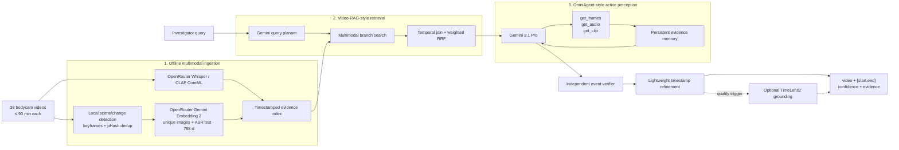

The expensive semantic model is neither the database nor the first-pass scanner. It reasons over a small, retrieved evidence neighborhood.

## Traceable PostgreSQL + pgvector storage

SQLite/FAISS remains useful for a dependency-light local smoke test. The production backend is `PostgresIndexStore` with `PostgresVectorIndex`:

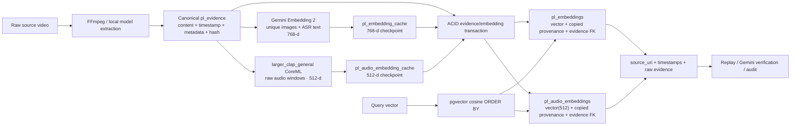

`pl_embeddings` intentionally duplicates the fields required to replay a hit: `video_id`, `segment_id`, `start_ms`, `end_ms`, `modality`, `source_uri`, `evidence_text`, `evidence_metadata`, `evidence_source`, `model_version`, `confidence`, `evidence_hash`, `source_sha256`, and `embedding_hash`. It also retains a foreign key to `pl_evidence`. The write path obtains the duplicated fields with `INSERT ... SELECT` from `pl_evidence JOIN pl_assets`, so an embedding cannot be created for missing evidence or an unknown video.

The ingestion pipeline validates every response and immediately commits it to a dimension-specific cache keyed by content hash, modality, model, dimensions, and preprocessing version. Gemini image/text vectors use `pl_embedding_cache` and `pl_embeddings.embedding_768`; CLAP audio vectors use `pl_audio_embedding_cache` and `pl_audio_embeddings.embedding_512`. Each space has an independent cosine HNSW index. A database trigger validates duplicated provenance on direct writes and synchronizes it when canonical evidence or asset metadata changes. A failed evidence insert can therefore be retried without another model call.

At retrieval time, pgvector returns the embedding row directly. The adapter reconstructs `Evidence` from that row and attaches `embedding_id`, `source_uri`, `model_version`, `evidence_hash`, `source_sha256`, and `embedding_hash` to the returned metadata. A caller can use `get_embedding_trace(embedding_id)` to retrieve the complete vector/provenance record for replay or audit.

## 1. Offline multimodal ingestion

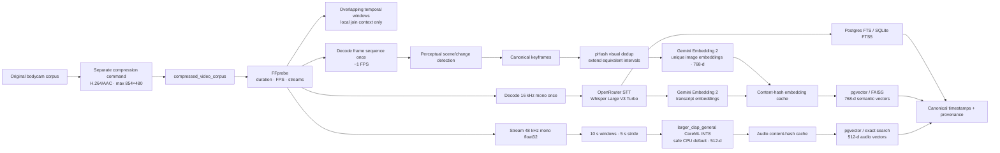

### Why these components exist

| Requirement | Component | Resolution |
|---|---|---|
| Visual appearance | Gemini Embedding 2 | Shared semantic search over locally deduplicated keyframe images |
| Spoken language | OpenRouter Whisper Large V3 Turbo | Checkpointed segment timestamps for Miranda rights, commands, names, and quotations |
| Acoustic semantics (full profile) | LAION larger_clap_general CoreML + paired ONNX text encoder | Open-vocabulary retrieval for shouting, sirens, gunshots, barking, music, and mixed acoustic events |
| Exact text lookup | Postgres FTS / SQLite FTS5 | Fast ASR transcript retrieval, preserving literal strings |
| Semantic lookup | pgvector / FAISS | Independent cosine search over Gemini 768-d image/text and CLAP 512-d audio vectors |
| Provenance | PostgreSQL | Model, confidence, source reference/hash, exact time span, and processing fingerprint |

Compression is outside ingestion and outside the artifact root. `patrol-lens compress` atomically mirrors source videos into a separate 854×480 H.264/AAC corpus and records source/output mappings in a manifest. Ingestion then treats whichever corpus path it receives as canonical, without retaining another video copy under the index. Processing windows organize temporal joining; they are not remote embedding units. ASR utterances, canonical visual intervals, and CLAP acoustic windows retain their own timestamps. Five-minute 16 kHz WAV chunks reach OpenRouter only for transcription. CLAP streams 48 kHz audio into a fixed 10-second CoreML input and never persists a second full-length WAV. Raw video reaches Gemini only through bounded tools after coarse retrieval. Current ingestion deliberately omits OCR, standalone speech-presence classification, and handcrafted RMS/pitch analysis.

### Long-video behavior

For a duration $D$, window size $W$, and stride $S$, the number of processing windows is approximately:

$$
N = \left\lceil\frac{D-W}{S}\right\rceil + 1
$$

For 90 minutes, `W=16 s`, and `S=8 s`, the implementation retains 674 local temporal windows. It does not embed them. The full profile additionally creates 1,079 CLAP audio windows at 10 seconds / 5-second stride. Frame decoding is a single sequential FFmpeg pass, adjacent equivalent frames are collapsed into canonical intervals, and CLAP audio is streamed with only its overlap buffer retained. Every 512-d result is cached before evidence insertion, so a failed run resumes from uncached windows. Enabling CLAP on an already completed corpus performs an additive audio-only backfill without re-running ASR or visual indexing.

There is no “replication worker” in this design. Horizontal ingestion workers may claim different videos, but SQLite/FAISS/pgvector replication is a deployment concern, not a semantic pipeline stage. Each video is fingerprinted by extraction settings and model namespaces: re-running the same command skips completed videos, while a failed video can be retried without `--force`; changing model, dimensions, or chunk settings intentionally selects a new ingestion fingerprint.

### Corpus scheduling and cost estimation

Corpus ingestion is scheduled oldest-file-update first. Before applying a
video batch limit, the scheduler classifies each asset as complete, pending,
incomplete, failed/retryable, forced rebuild, or local CLAP backfill. Complete
assets are excluded, preventing a small repeated batch from getting stuck on
the same already-indexed videos.

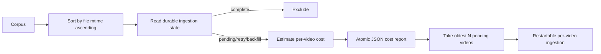

The report estimates Whisper from audio duration, transcript embedding tokens
from a configurable tokens-per-minute assumption, and image embedding tokens
from frame sampling plus Gemini image tiling. Existing matching keyframe
manifests replace the all-frames-unique upper bound. CLAP remains local and has
zero remote inference cost. Rates and assumptions are recorded in each report
and can be overridden without changing the indexing fingerprint.

## 2. Query planning and coarse retrieval

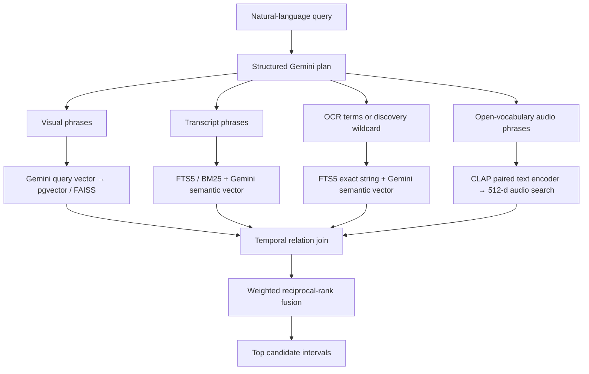

The planner emits branch queries, required modalities, relation (`overlap`, `before`, `after`, `sequence`, or `any`), relation tolerance, and target (`event` or `onset`). A deterministic planner remains available for tests and offline debugging.

For branch result rank $r_m(e)$, fusion contributes:

$$
score(c) = \sum_m \frac{w_m}{k + r_m(c)}
$$

with `k=60` by default. Raw score scales from heterogeneous models are therefore not compared directly. Before fusion, evidence must satisfy the temporal relation. For a conjunctive query, candidates missing a required modality are discarded. This intentionally favors precision.

Example plan:

```json
{
  "visual_queries": ["person wearing a red jacket"],
  "audio_queries": ["elevated vocal intensity shouting"],
  "required_modalities": ["visual", "audio_event"],
  "relation": "overlap",
  "target": "onset",
  "target_boundary": "onset",
  "requires_video_verification": true
}
```

At this stage the result means “worth inspecting,” not “confirmed.”

## 3. Active perception

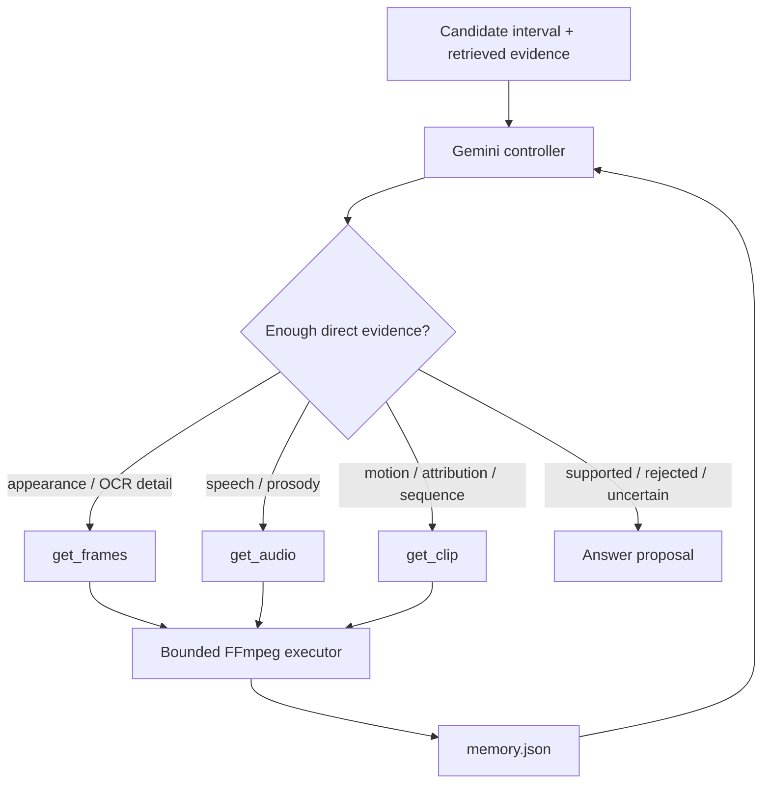

The controller is independently implemented from OmniAgent's research environment but preserves its useful interface. Limits are enforced outside the model:

- no request may leave the candidate interval;
- at most 12 frames per frame action;
- at most 30 seconds per audio action;
- at most 20 seconds per clip action;
- repeated actions are rejected;
- default maximum is five turns;
- a cross-modal supported answer is blocked until required visual/audio media has been directly inspected.

Each action, observation path, compact assessment, retrieved item, and controller warning is atomically persisted to `INDEX/runs/RUN_ID/memory.json`. Raw media does not accumulate in the prompt; compact evidence memory does.

### Bounded candidate scheduling

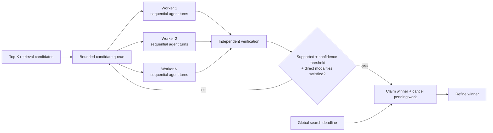

`candidate_parallelism` bounds concurrent candidates without parallelizing an
individual candidate's agent turns. `early_stop_confidence` is applied only to
verifier-supported evidence whose required visual/audio modalities were
directly inspected. `timeout_s` starts before retrieval. Completed supported
verification is retained as a provisional fallback, so timeout returns the
best supported evidence available even if its refinement call is still in
flight. Candidate-specific failures remain warnings and do not terminate other
workers. These controls are opt-in; their omitted defaults preserve sequential
search with no early stop or global deadline.

### Durable run trajectories and budgets

Every search and retrieval invocation is a persistent thread. A centralized,
thread-safe recorder appends versioned events to
`INDEX/history/RUN_ID/trajectory.jsonl`, atomically refreshes `summary.json`,
and appends lightweight snapshots to `INDEX/history/index.jsonl`. The event
graph uses explicit parent and candidate IDs, so concurrent candidate branches
do not depend on JSONL ordering.

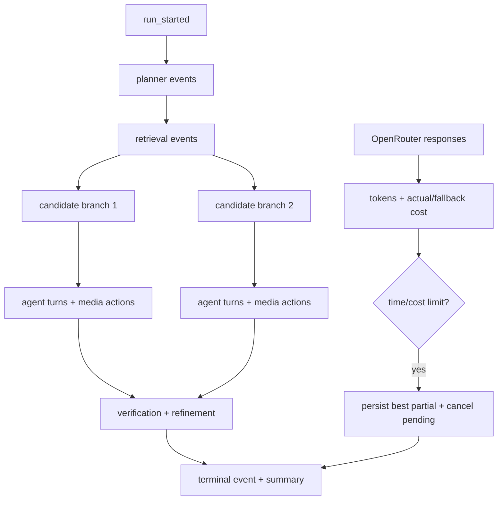

Model requests store summaries and media paths, never inline bytes. Provider
usage is normalized after each response; if the provider omits cost, the
configured conservative per-call estimate is used for accounting. Before
candidate inference, the pipeline estimates `(candidate count × maximum model
calls per candidate)` plus retrieval spend. A limit breach prevents future
work but cannot roll back trajectory events or completed supported evidence.
The global history index allows `patrol-lens history` to list threads without
replaying all trajectory files.

## 4. Semantic verification

The active controller proposes an answer. A separate Gemini call is the final semantic gate.

Inputs:

- original query and structured plan;
- candidate interval;
- retrieved ASR/OCR/visual/audio evidence;
- active-observation summaries;
- selected decisive frames/audio/clips.

Output:

```yaml
status: supported | rejected | uncertain
event_description: string
start_ms: integer
end_ms: integer
confidence: 0..1
evidence:
  visual: []
  audio: []
  transcript: []
  ocr: []
missing_evidence: []
```

The verifier is instructed to reject mere co-occurrence, unsupported speaker attribution, and causal inference. Intervals are clamped to the candidate boundary. Retrieval score and verifier confidence remain separate fields.

## 5. Timestamp refinement

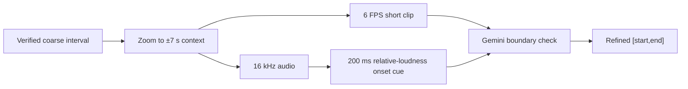

The deterministic audio onset is only a boundary hint; it cannot establish shouting or speaker identity. Gemini uses the already-verified event semantics to choose the first and last supporting instants. The implementation expands the verified interval by up to `context_ms=7 s`, clamps that context to the candidate, and caps the media window at 20 s. It performs two new local FFmpeg extractions: a 6 FPS H.264/AAC clip and a separate mono 16 kHz PCM WAV; it does not reuse decoded media from verification.

### Design choice and observed tradeoff

Keep refinement verifier-gated and boundary-focused. It is valuable for onset/offset queries or broad verified intervals, but it cannot recover a missed event and is not needed to establish semantic event correctness. In bounded search it runs on the claimed winner; in the default sequential path, each supported candidate may reach refinement. A cheap policy gate should skip it for event-only queries or intervals already within the required temporal tolerance.

The inspected reference run is an operational check, not an accuracy benchmark: refinement started with `[86,000, 91,000]`, generated `[85,000, 98,000]` of context, returned the unchanged `[86,000, 91,000]` interval, and found no deterministic onset cue. The refinement phase took 10.423 s end to end; its Gemini request took 10.103 s, used 2,233 reported tokens, and cost $0.00153787. These measurements do not support fixed assumptions such as +2–4 s, 100–300 tokens, or $0.0001–$0.0005 per call.

The step can improve endpoint error without changing retrieval recall, but a successful model response can still over-refine within the allowed context; clamping prevents out-of-window output, not an incorrect boundary. Exceptions retain the verified interval with a warning. Therefore, do not claim a universal temporal-IoU gain (such as 5–15%) until a held-out, annotated comparison of verifier-only versus gated refinement reports temporal IoU, absolute boundary error, no-op/fallback rate, p95 latency, and provider cost.

## 6. Optional TimeLens2 boundary

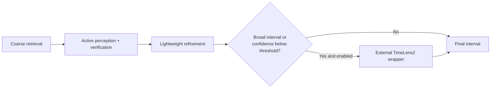

TimeLens2 is deliberately not a candidate generator. It is a specialist invoked only when Gemini finds the correct event but boundaries remain poor. The adapter accepts one or more intervals and supports repeated-event output.

The core package has no TimeLens2 import. A subprocess interface isolates its environment and restrictive license. Activation requires an explicit command and acknowledgement.

## Final query lifecycle

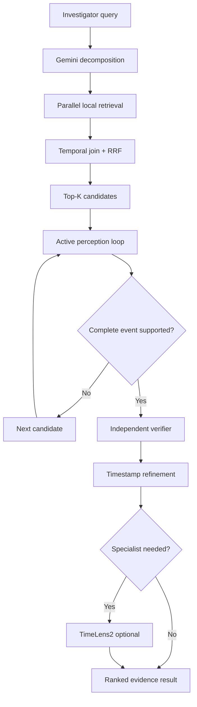

## Hotswappable boundaries

| Boundary | Protocol / file | Current implementation | Replacement examples |
|---|---|---|---|
| ASR | `ASRBackend` | OpenRouter Whisper Large V3 Turbo | faster-whisper, agency transcript |
| Semantic embedding | `EmbeddingBackend` / `TextEncoder` | OpenRouter Gemini Embedding 2 (synchronous ingestion endpoint) | direct Gemini API, another multimodal embedding provider |
| Local visual fallback | `VisualBackend` / `TextEncoder` | SigLIP2 | video-native encoder, CLIP |
| Audio semantics | `AudioEmbeddingBackend` / `TextEncoder` | larger_clap_general CoreML audio + paired ONNX text | PANNs, another paired audio-text encoder |
| Text index | `IndexStore` | SQLite FTS5 | OpenSearch, Tantivy |
| Vector index | `VectorIndex` | FAISS with exact fallback | Qdrant, Milvus, pgvector |
| Query planner | `QueryPlanner` | Gemini or heuristic | another structured LLM/planner |
| Active policy | `ActivePolicy` | Gemini 3.1 Pro | local multimodal policy |
| Verifier | `EventVerifier` | Gemini 3.1 Pro | another frontier VLM or ensemble |
| Temporal specialist | subprocess adapter | TimeLens2 optional | any interval-grounding service |

The domain dataclasses and JSON schemas are provider-neutral. OpenRouter's OpenAI-compatible transport is isolated to `adapters/openrouter.py`; `adapters/gemini.py` remains a compatibility import for existing callers.

## Repository mapping

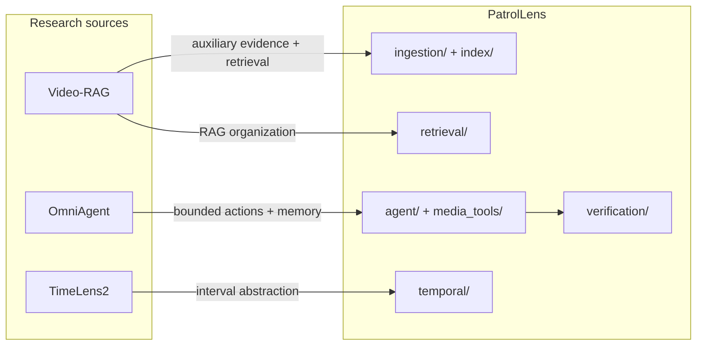

No upstream source is vendored. Exact inspected commits and licensing notes are in [upstreams.lock.json](upstreams.lock.json) and [THIRD_PARTY.md](THIRD_PARTY.md).

## Failure behavior

- Missing local model dependency: fail with a named optional-extra message; do not silently omit a requested modality.
- Gemini planner failure: fall back to deterministic planning.
- Invalid/repeated/out-of-range agent action: reject it, record a controller note, and continue within the turn budget.
- Candidate-specific media/API failure: record a warning and continue to the next candidate.
- Timeout, budget exhaustion, provider failure, or Ctrl+C: flush the run trajectory and retain the best partial result, cumulative cost, elapsed time, and last completed stage.
- Verifier rejection/uncertainty: do not emit a result.
- Refinement failure: retain the verified interval with a warning.
- TimeLens2 failure: retain lightweight grounding with a warning.
- No FAISS installation/index: use exact SQLite vector search, preserving correctness at lower scale.

## Evaluation strategy

Evaluate the stages separately so a strong verifier cannot hide retrieval misses and broad retrieval cannot hide boundary errors:

1. Candidate recall@K and false candidates/query.
2. Event verifier precision, recall, and calibration.
3. Temporal IoU plus absolute start/end error.
4. Cross-modal attribution accuracy on adversarial negatives.
5. ASR word error rate on bodycam acoustics.
6. Cost, media seconds sent to Gemini, and active turns/query.

The TimeLens2 activation decision should be data-driven: add it only when the verifier consistently finds the right event but gated lightweight refinement produces unnecessarily broad intervals, high boundary error, or low temporal IoU. The same evaluation must include the added latency, provider cost, media extraction time, and fallback/no-op rate.
