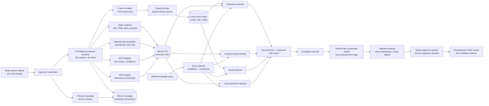

# PatrolLens System Design

## Problem formalization

Let the corpus be a set of videos:

\[
\mathcal{V} = \{v_1, v_2, \ldots, v_n\}, \qquad v_i \text{ has duration } T_i \leq 90\text{ minutes}.
\]

For each video, the ingestion pipeline creates timestamped observations from several modalities:

\[
O_i^m = \{(a, b, x, c)\}, \qquad m \in \{visual, clip, audio, speech, OCR\}
\]

where `[a,b]` is a source-video interval, `x` is an embedding, transcript, OCR string, or acoustic feature, and `c` is an optional confidence value.

Given a natural-language query `q`, the system must return a ranked set of intervals:

\[
R(q) = \{(v_i, a, b, score, evidence)\}
\]

The desired result is not merely a similar frame. It is an interval where the queried event is supported by the appropriate evidence, including temporal order and cross-modal relationships.

The conceptual ranking function is:

\[
Score(q,s) = \operatorname{RRF}(q,s) + \lambda\,TemporalConsistency(q,s) + \mu\,EvidenceSupport(q,s)
\]

The implementation approximates this with modality-specific retrieval, reciprocal-rank fusion, temporal merging, and a final multimodal verifier. Precision is prioritized over recall for the final returned results; low-confidence matches remain explicitly marked as uncertain.

## Architecture



## How the design solves the problem

### Visual and temporal understanding

Frame-level visual vectors provide broad recall for objects, colors, people, vehicles, and clothing. They remain associated with their original frame timestamps instead of being averaged into one video vector.

Temporal windows provide event context. A short clip verifier examines ordered frames for actions such as handcuffing or pulling a vehicle over. This separates static appearance search from motion and event reasoning.

### Speech, audio, and visible text

- ASR converts spoken language into searchable text with word-level timestamps. It supports Miranda-rights searches, spoken commands, names, and addresses.
- Audio analysis produces speech activity, loudness, pitch, and prosody features. This supports raised-voice searches even when the transcript does not contain the word “shouting.”
- OCR extracts visible text and its location. It supports license plates, street signs, IDs, and dashboard text.

Each modality is indexed independently so a model or provider can be replaced without changing the query API.

### Timestamp localization

The system uses a two-stage temporal strategy:

1. Retrieve overlapping coarse windows from precomputed indexes.
2. Resample only candidate windows densely and ask the verifier for event-relative offsets.

Relative offsets are converted to source-video timestamps, clamped to the candidate interval, validated, and then merged with adjacent detections. This keeps results useful for 90-minute videos without submitting the full video to a hosted model.

### Cross-modal reasoning

The query planner converts natural language into modality weights and constraints. A compound query can be represented conceptually as:

```text
person wearing red shirt
AND elevated vocal intensity
WITHIN 15 seconds
```

The retrieval branches first find evidence independently. Temporal fusion then joins nearby evidence before the OpenRouter verifier receives the selected clip, transcript, OCR, and acoustic features. The verifier must return structured evidence and timestamps rather than an unsupported free-form answer.

## 90-minute video strategy

Indexing is performed once and cached by video hash, model version, and configuration. A 90-minute video produces approximately:

- 5,400 one-FPS frame samples;
- 674 overlapping 16-second coarse windows;
- a continuous audio/prosody timeline;
- one timestamped transcript.

Queries operate on SQLite and local vector records. Only the strongest candidate intervals are decoded again and optionally sent to OpenRouter. This makes query latency independent of repeatedly processing all 90 minutes of raw pixels.

## Result contract

Every result contains:

```json
{
  "video_id": "video-abc",
  "start_s": 1842.6,
  "end_s": 1851.4,
  "score": 0.87,
  "evidence": [
    {
      "modality": "transcript",
      "start_s": 1847.2,
      "end_s": 1850.1,
      "text": "..."
    }
  ],
  "warnings": []
}
```

The result is an evidence-backed interval, not a claim that the model understood the entire video. OCR ambiguity, acoustic heuristics, provider failures, and low-confidence model judgments are surfaced in `warnings` or confidence fields.

## Main tradeoff

The design spends inexpensive local computation on broad indexing and expensive multimodal reasoning only on a small candidate set. This gives better temporal and cross-modal correctness than frame-only retrieval while preserving model hotswappability and keeping 90-minute videos operationally manageable.
